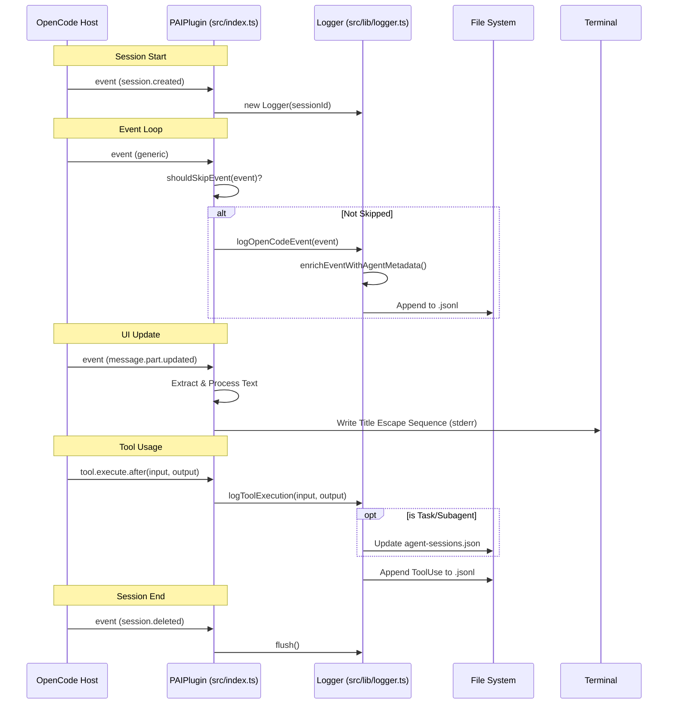

# OpenCode PAI Plugin: Process Flow Analysis

## Overview

This document details the **actual execution flow** of the `opencode-pai-plugin` as implemented in `src/index.ts` and its dependencies. It focuses on the active code paths, ignoring unused modules or theoretical capabilities not currently wired into the entry point.

**Target Audience**: Plugin Developers & System Integrators.

## Entry Point: `src/index.ts`

The plugin's lifecycle is managed by the `PAIPlugin` function, which initializes state and returns a set of hooks to the OpenCode host.

### Initialization Phase

When the plugin is loaded:
1.  **State Initialization**: Local variables are set up to track:
    *   `logger`: Instance of the `Logger` class (initially null).
    *   `currentSessionId`: ID of the active session (initially null).
    *   `titleUpdatesDisabled`: Circuit breaker flag for terminal title updates (initially false).
2.  **Hook Registration**: The plugin returns an object containing two main hooks:
    *   `event`: Handles session lifecycle and general events.
    *   `tool.execute.after`: Handles logging of tool outputs.

## Event Processing Loop

The core logic resides in the `event` hook.

### 1. Session Creation (`session.created`)
*   **Trigger**: A new session starts.
*   **Action**:
    1.  Captures `session_id` from event properties.
    2.  Instantiates a new `Logger` (from `src/lib/logger.ts`) with the session ID and project worktree.

### 2. General Event Logging
*   **Trigger**: Any event (except specific exclusions).
*   **Filtering**: The `shouldSkipEvent` function filters out:
    *   `file.watcher.updated` events on the `raw-outputs` directory (to prevent logging loop).
    *   `message.updated` events that contain self-referencing diffs to `raw-outputs`.
    *   `message.part.updated` events (logged separately or ignored to reduce noise, though strictly the code says `event.type !== 'message.part.updated'` prevents generic logging for this type).
*   **Action**: Calls `logger.logOpenCodeEvent(event)` to persist the event.

### 3. Terminal Title Updates
*   **Trigger**: `message.part.updated` where `part.type === 'text'`.
*   **Conditions**: `titleUpdatesDisabled` must be false.
*   **Logic**:
    1.  Extracts prompt text.
    2.  Tokenizes and filters stop words (the, and, etc.).
    3.  Selects first 3 significant words to form a "Tab Title".
    4.  Prepends Emoji (♻️).
    5.  **Output**: Writes escape sequence `\x1b]0;...` to `process.stderr`.
    6.  **Safety**: Catches any errors; if one occurs, sets `titleUpdatesDisabled = true` to prevent TUI corruption.

### 4. Session Deletion (`session.deleted`)
*   **Action**: Calls `logger.flush()` (currently a no-op implementation) to finalize logs.

## Tool Execution Flow

### Hook: `tool.execute.after`
*   **Trigger**: Completion of a tool execution.
*   **Action**: Calls `logger.logToolExecution(input, output)`.
*   **Side Effects**:
    *   **Agent Mapping**: If the tool is `Task` with a `subagent_type`, it updates `agent-sessions.json` to map the current session to that subagent.
    *   **Logging**: Writes a `ToolUse` event to the JSONL log.

## Data Persistence & Logging (`src/lib/logger.ts`)

The `Logger` class handles writing to the file system.

### Directory Structure
It relies on `src/lib/paths.ts` to resolve `PAI_DIR` (default: `~/.claude`).
*   **Events**: `~/.claude/history/raw-outputs/YYYY-MM/YYYY-MM-DD_all-events.jsonl`
*   **Errors**: `~/.claude/history/system-logs/YYYY-MM-DD_errors.log`
*   **Agent Mapping**: `~/.claude/agent-sessions.json`

### Metadata Enrichment (`src/lib/metadata-extraction.ts`)
Before writing, events are enriched using `enrichEventWithAgentMetadata`.
*   **Logic**: Parses tool prompts/descriptions to extract:
    *   `agent_instance_id` (e.g., "perplexity-researcher-1")
    *   `parent_session_id`
    *   `parent_task_id`

## Visual Process Flow

## Discrepancies & Unused Modules

The following modules exist in the codebase but are **not** invoked in the current execution flow starting from `src/index.ts`:

1.  `src/lib/context-loader.ts`: Intended for injecting `core/SKILL.md`, but never imported or called.
2.  `src/lib/notifier.ts`: Intended for sending notifications to a local server, but never imported or called.
